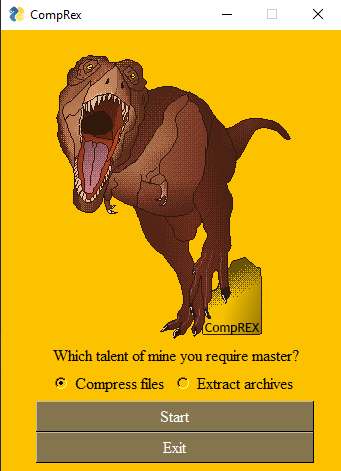
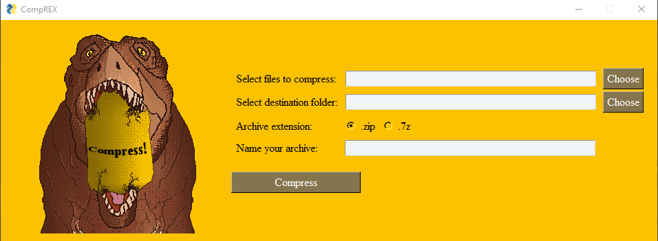

# CompRex

With this desktop app, you are able to compress zip, 7z files and extract .zip, .7z and .rar files. It also contains some cool pixelart dinos!
This app was created in Python, using PySimpleGUI for its frontend.
### How to use:

Simply click on the exe file and start the app.
You will be greeted with this window:

Select which option you want and press the "start" button.

For example, this is the compress window:

### Future goals:

- Exception handling 
- New dino art for extraction window 
- More type of archives to create and extract 
- Integrating app into desktop system 